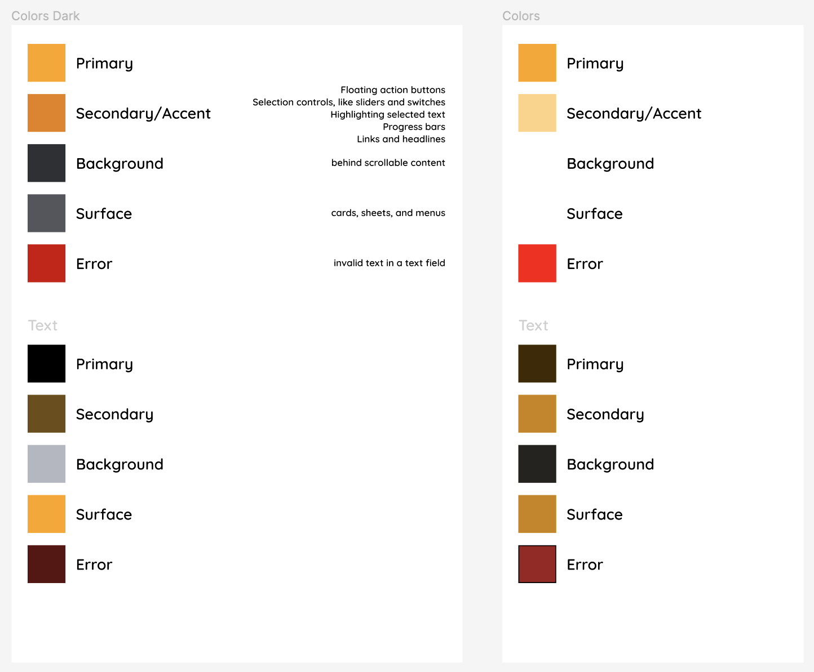
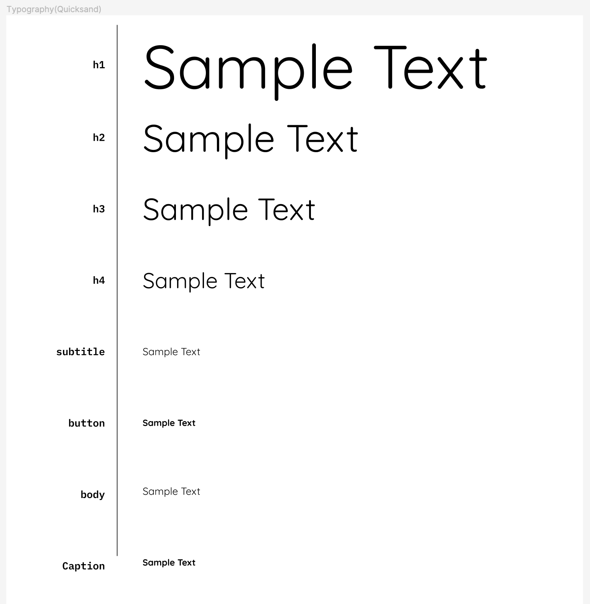

# Design System

A design system is a collection of reusable components, guided by clear standards, that can be assembled together to build any number of applications.
(This collection of reusable components can also be referred to as a Pattern Library). The design system for developer purposes consists of five major sections:
* **Layout** - The spacing and organization of components
* **Typography** - The font and styling of text
* **Color** - The colors used in the design
* **Components** - UI elements used in the design
* **Iconography** - logos and images used in the design

## Defining a Design System

An Atomik Design System currently handles three parts of the design System: color, typography and components.

The `DesignSystem` takes in four variables, a `ColorSet`, a `TypographySet`, a map of `Atoms`, and a `fontFamily`

```kotlin
open class DesignSystem(
    open val colorSet: ColorSet,
    open val typographySet: TypographySet,
    open val atoms: Map<String, Atom>,
    open var fontFamily: AtomikFontFamily? = null
)
```
  
:::note

The font family is a temporary addition and can be removed once common fonts are added

:::

### Preset Design Systems

The `DesignSystem` should encompass all of the elements of your other Atomik classes. The `DesignSystem` takes in interfaces for colors and typography, and can be easily customized. Additionally there are some existing presets that are recommended based on what you need:
* `DefaultDesignSystem` - A default implementation of a `DesignSystem`, contains useful data for most cases
* `PlatformDesignSystem` - Based on the Platforms structure, meshes well with structures like compose Typograhy.
* `CustomDesignSystem`  - A customizeable `DesignSystem`, supports a completely unique pattern rather than using standards like `h1` and `body` for typography


## Design System Elements

### ColorSet



`ColorSet` is an interface that is meant to contain all colors in your project. Most ColorSets are classes that contain a Map of Colors and a fallback color in case it's not found.

```kotlin
public interface ColorSet {
    public val fallbackColor: AtomikColor
    public fun getColor(name: String): AtomikColor
}
```

`ColorSets` are made up of various [AtomikColor](./colors.md)

They can be implemented, however there's also a `DefaultColorSet` for a standard set. There is also a `CustomColorSet` that can be used for more granularity.

```kotlin
val colorSet = DefaultColorSet(
    primary = AtomikColor(0xFFFFA500),
    secondary = AtomikColor(0xFFFFD383),
    background = AtomikColor(0xFFFFFFFF),
    surface = AtomikColor(0xFFFFFFFF),
    error = AtomikColor(0xFFFF0000),

    primaryText = AtomikColor(0xFF402900),
    secondaryText = AtomikColor(0xFFFFA500),
    backgroundText = AtomikColor(0xFF25231F),
    surfaceText = AtomikColor(0xFFFFA500),
    errorText = AtomikColor(0xFF9E1F1F),
)
```

### TypographySet




`TypographySet` is an interface that is meant to contain all typography data in your project. It is an interface that can be implemented, however there's also a `DefaultTypographySet` for a standard set. There is also a `CustomTypographySet` that can be used for granularity.

`TypographySets` are made up of various `AtomikTypography`, which are referenced by a [TypographyType](./typography).

```kotlin
val typographySet = DefaultTypographySet(
    h1 = AtomikTypography(size = 96),
    h2 = AtomikTypography(size = 60),
    h3 = AtomikTypography(size = 48),
    h4 = AtomikTypography(size = 34),
    subtitle = AtomikTypography(size = 16),
    button = AtomikTypography(weight = AtomikTypographyWeight.BOLD, size = 14),
    body = AtomikTypography(size = 16),
    caption = AtomikTypography(weight = AtomikTypographyWeight.BOLD, size = 14),
)
```

### FontFamily

The `AtomikFontFamily` is an expect/actual class for platform specific fonts. When initializing the Design System it's easier to set it to null and pass in the `FontFamily` later, when the app is started

:::note

The font family is a temporary addition and can be removed once common fonts are added

:::

#### Android

```kotlin
val fontFamily = FontFamily(
    Font(R.font.quicksand_regular),
    Font(R.font.quicksand_bold, FontWeight.Bold),
    Font(R.font.quicksand_light, FontWeight.Light),
    Font(R.font.quicksand_medium, FontWeight.Medium),
    Font(R.font.quicksand_semibold, FontWeight.SemiBold),
)
designSystem.fontFamily = AtomikFontFamily(fontFamily)
```

#### iOS

```swift
let fontFamily = [
    .bold: UIFont(name: "Quicksand-Bold", size: 12)!,
    .light: UIFont(name: "Quicksand-Light", size: 12)!,
    .medium: UIFont(name: "Quicksand-Medium", size: 12)!,
    .normal: UIFont(name: "Quicksand-Regular", size: 12)!,
    .semibold: UIFont(name: "Quicksand-SemiBold", size: 12)!
]
UIDesignKt.designSystem.fontFamily = AtomikAtomikFontFamily(uiFonts: fontFamily)
```